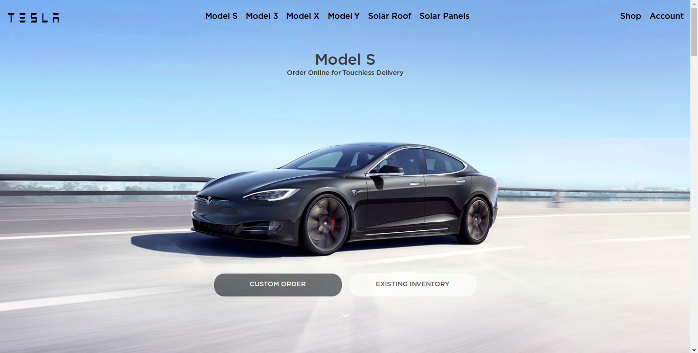
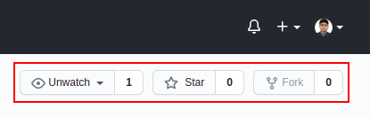

  <h3 align="center">Tesla Homepage Clone</h3>

  <p align="center">
    A clone of the Tesla homepage!
    <br />
    <a href="https://therangecoder.github.io/tesla-clone/"><strong>View Demo »</strong></a>
    <br />
  </p>
</p>


<!-- TABLE OF CONTENTS -->
<details open="open">
  <summary>Table of Contents</summary>
  <ol>
    <li>
      <a href="#about-the-project">About The Project</a>
      <ul>
        <li><a href="#built-with">Built With</a></li>
      </ul>
    </li>
    <li>
      <a href="#getting-started">Getting Started</a>
      <ul>
      	<li><a href="#prerequisites">Prerequisites</a></li>
        <li><a href="#installation">Installation</a></li>
      </ul>
    </li>
    <li><a href="#usage">Usage</a></li>
    <li><a href="#license">License</a></li>
    <li><a href="#contact">Contact</a></li>
    <li><a href="#acknowledgements">Acknowledgements</a></li>
  </ol>
</details>


<!-- ABOUT THE PROJECT -->
## About The Project

<div style="display: flex"></div>

This project has been an attempt of mine, to use my React.js and Material-UI skills, to build a clone of the Tesla homepage.<br/>

### Built With

These are the technologies that I used to build the clone:
* React.js
* Material-UI


<!-- GETTING STARTED -->
## Getting Started

To get a local copy of the Tesla clone, up and running on your browser, follow these steps.

### Prerequisites

In order to be able to run the clone successfully on the browser of your system, the following needs to be installed on your system:

1. An adequate version of <a href='https://nodejs.org/en/'>`Node.js`</a>


### Installation

1. Fork this repository
<div style="display: flex"></div>

2. Clone the repository
   ```sh
   git clone https://github.com/[your_username]/tesla-clone.git
   ```

3. Navigate into the root directory
   ```sh
   cd tesla-clone
   ```
   
4. Install the dependencies, needed for the project
   ```sh
   npm install
   ```
   
5. Run the clone on your browser
   ```sh
   npm start
   ```


<!-- USAGE EXAMPLES -->
## Usage

Once you have successfully installed the required dependencies and started the clone on your browser (it usually runs on port 3000 of the local host, by default), have fun going through it!


<!-- LICENSE -->
## License

The README template, used for this project, was distributed under the MIT License. See `LICENSE` for more information.


<!-- CONTACT -->
## Contact

#### Shuvadarshan Bhual
* Drop me an [email](mailto:sbhual1998@gmail.com) 
* Follow me on [Twitter](https://twitter.com/theRangeCoder)
* Let us connect on [LinkedIn](https://www.linkedin.com/in/shuvadarshan-bhual)


<!-- ACKNOWLEDGEMENTS -->
## Acknowledgements
* The background images, logo and font were obtained from [this link](https://drive.google.com/drive/folders/1Myd9OK3EIm9EXgP1AAch_YEwF2-ngPqH), which can be found in the description of [this video](https://www.youtube.com/watch?v=Wn8Q8VbZIMQ)
* [Othneil Drew](https://www.othneildrew.com) for the [README template](https://github.com/othneildrew/Best-README-Template)
